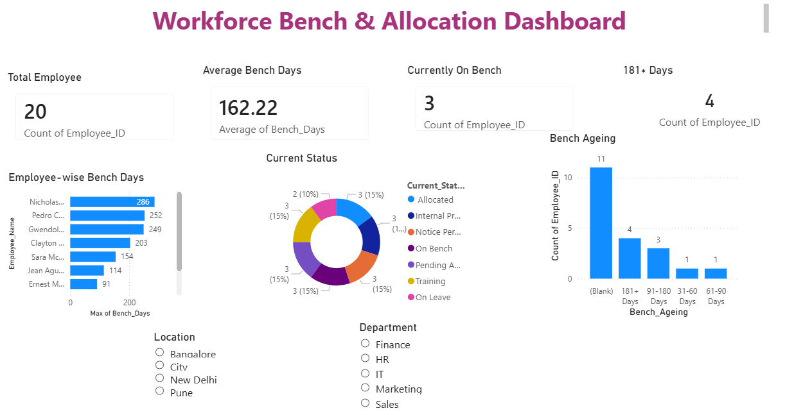

# 📊 Employee Data Analysis Dashboard

## 📌 Project Overview

A beginner-level Power BI project created using a sample dataset of 20 employee records.

The project focuses on basic data cleaning, transformation, visualization, and dashboard creation using Power BI.

## 🛠️ Tools Used

- Microsoft Power BI
- Power Query
- DAX
- Microsoft Excel

## 📂 Dataset

Sample employee dataset containing 20 records.

**Source:** `EMPLOYEE_DATA.xlsx`

## 📊 Dashboard Preview

## 💡 Key Learning

- Excel data import
- Data cleaning with Power Query
- Basic DAX calculations
- Data visualization
- Power BI dashboard creation

## 📁 Project Files

| File | Description |
|---|---|
| `EMPLOYEE_DATA.xlsx` | Sample employee dataset |
| `EMPDATA.pbix` | Power BI report |
| `EMPDATA.png` | Dashboard preview |

## 👩‍💻 Author

**Avantika**  
Aspiring Data Analyst | Power BI | SQL | Excel
